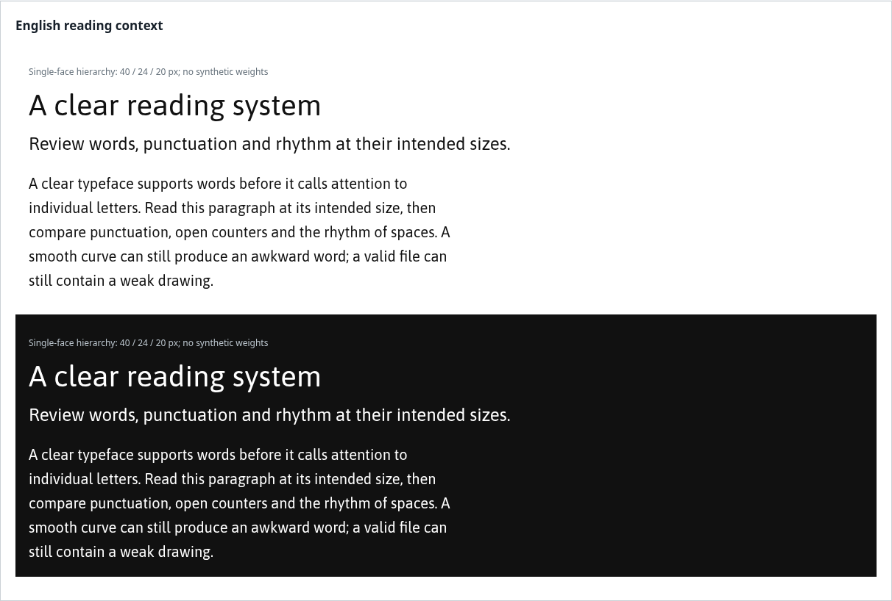

# Typography Studio

An open agent skill and Codex plugin for **font design, type design and visual
typographic review**. Start from a brief, develop a system of glyphs, render
real words, inspect the result and refine spacing, families and hierarchy.
The workflow is independent of any brand, typeface or house style.



Helper output with the existing open-source **Asap Regular**, not a font drawn
by this skill. The font is not distributed. See [validation and attribution](docs/VALIDATION.md).

**Version 0.4.1.** English and Spanish instructions, references, templates
and ready-to-install localized packages. It is a
review workflow with optional proofing helpers, not an autonomous font editor
or a certificate of typographic quality. The included corpus focuses on Latin
English and Spanish; adapt it and use appropriate expertise for other scripts.

[Documentación en español](README.es.md) · [Publishing](docs/PUBLISHING.md) ·
[Sources](plugins/typography-studio/skills/typography-design-review/references/sources.md)

## What it helps you do

- Translate purpose, voice, repertoire and sizes into drawing constraints.
- Develop control glyphs, optical corrections, counters and coherent terminals.
- Review real words, sidebearings, kerning, punctuation and recognition.
- Develop weights, italics, variable families and faithful exports.
- Review apparent size, leading, line length and responsive hierarchy.
- Record separate technical evidence, visual judgments and reader-test results.

No helper returns a quality score. The agent must open the rendered proofs.
Unsupported glyphs, untested platforms and unavailable images remain explicit
gaps rather than positive results. See the
[skill](plugins/typography-studio/skills/typography-design-review/SKILL.md).

## Install the skill

Copy `plugins/typography-studio/skills/typography-design-review/` into your
project's `.agents/skills/` directory. The resulting entry is
`.agents/skills/typography-design-review/SKILL.md`. This manual route works
without installing the plugin or its optional helper dependencies.

Start with a request such as:

> Use $typography-design-review to design a clear, forceful display sans for
> English and Spanish. Begin with H/O/n/o and inspect words before expanding.

> Use $typography-design-review to review this font's spacing and punctuation
> at 16, 24 and 48 px. Compare actual images and preserve the current source.

For Spanish install entrypoints and interface text, use the `-es.zip` packages
from [release v0.4.1](https://github.com/martinsantos/typography-studio/releases/tag/v0.4.1).
The agent should answer in your language. Use an agent with image inspection
and the editor/compiler your project needs.

## Install the plugin from a checkout

The repository includes a Codex marketplace at
`.agents/plugins/marketplace.json`. In a client with plugin support:

```sh
codex plugin marketplace add /absolute/path/to/typography-studio
codex plugin add typography-studio@typography-studio-marketplace
```

For GitHub installation after the public repository exists, see
[Publishing](docs/PUBLISHING.md). This package uses the supported
`.codex-plugin/plugin.json` compatibility format. It has one skill, no MCP
server, no account connection and no hooks. Host availability varies.

## Build and verify the distribution

Packaging uses Python 3.10+ and the standard library only:

```sh
python3 scripts/validate.py
python3 scripts/package.py --output dist
```

The packager produces plugin, standalone skill and marketplace ZIPs in English
and Spanish, plus SHA-256 checksums. The `-es.zip` editions localize install
entrypoints, interface metadata and proof defaults while preserving identities
and executable helpers. It refuses to
overwrite an existing output directory. Optional font proofing uses FontTools
and Playwright; see [Tooling](plugins/typography-studio/skills/typography-design-review/references/tooling.md).

## Publish and contribute

A public GitHub repository makes the source findable and reusable. A repo
marketplace allows compatible clients to install it. Listing in OpenAI's
public Plugins Directory is a separate verified-publisher submission and
review, documented in [PUBLISHING.md](docs/PUBLISHING.md). An uploaded ZIP or
a GitHub release is not evidence of public-directory approval.

[CONTRIBUTING.md](CONTRIBUTING.md) explains evidence-based changes.
[Evaluation cases](evals/cases.json) are proposed behavioral checks, not a
completed independent benchmark of agents' type-design ability.

MIT covers this project's original instructions, scripts and assets. Font
files supplied by users retain their own licenses. No fonts, third-party
PDFs or copied instructional chapters are distributed here. Sources are
attributed; their authors have not endorsed this package.
